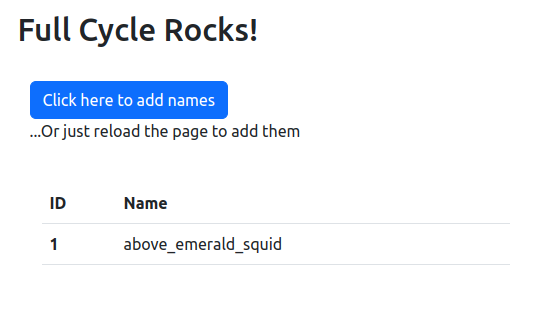

# Node-Nginx Challenge

## Instructions

1 - Clone this repository

```bash
git clone git@github.com:andersonfpcorrea/fullcycle.git
```

2 - cd to `nginx-node`

```bash
cd 1-docker/challenges/nginx-node/
```

3 - Run the containers

```bash
docker compose up --build
```

4 - Access [localhost:8080](http://localhost:8080) to see the app

</br>



## Description

There are three services for the application:

- MySQL database
- Node.js server
- Nginx reverse proxy

After running all the containers, it is possible to have access to the application through [localhost:8080](http://localhost:8080).

The client's requests are handled by the `Nginx` reverse proxy, which pass the request to the `Node.js` app.

On every request, it is created a new entry into the `MySQL` database with a randomly generated name, which is then sent back to the client.

The front-end components are styled with `Bootstrap`.
